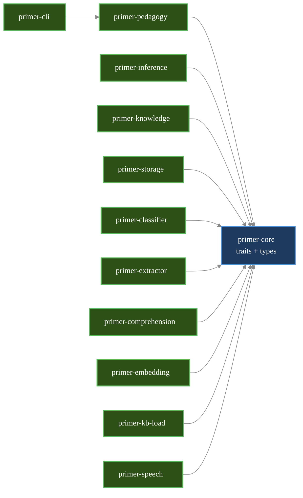

# Architecture overview

## The central design principle

Trait-based hardware abstraction. Backend selection is a runtime config choice, not a code change. This is what allows Phase 0 (cloud) to share code with Phase 1 (local NPU) and Phase 2 (voice).

Concretely: the pedagogical engine — the part that decides what the Primer says next, when to ask a Socratic question, when to suggest a break — never imports `reqwest`, never knows whether inference is happening on a cloud GPU or a local NPU, never cares whether speech is synthesized through Piper or skipped entirely. It talks to traits defined in `primer-core`, and at startup the CLI wires concrete implementations into those slots. Swapping cloud Claude for a local llama.cpp build is a config flag, not a refactor. Adding a new speech engine means writing a new struct that implements `TextToSpeech` and registering it; nothing else changes.

This is the load-bearing decision in the codebase. Most other architectural choices follow from it.

## The crate graph

The workspace is twelve crates organised in three layers: a binary at the top, a pedagogical engine in the middle, and a constellation of trait-implementing crates at the bottom that all depend on `primer-core` (which defines every public trait).

Why does this matter to you? Because almost every contribution touches one of these crates, and the dependency arrows tell you what you can change in isolation and what ripples outward. A new inference backend is a self-contained PR inside `primer-inference`. A change to the `KnowledgeBase` trait signature, by contrast, ripples through every consumer. The diagram below is your map for the rest of this manual — subsequent chapters drill into individual crates, and each one assumes you know roughly where it sits.

> **Legend:** blue = trait/interface (defined in `primer-core`); green = concrete implementation. Subsequent chapters introduce amber (external boundary) and grey (stub / test-only) for diagrams that need them.



ASCII fallback for environments where mermaid does not render:

```
primer-cli  →  primer-pedagogy  →  primer-core  ←  primer-inference, primer-speech, primer-knowledge, primer-storage, primer-classifier, primer-comprehension, primer-extractor, primer-embedding, primer-kb-load
```

`primer-cli` additionally depends on every concrete impl crate (`primer-inference`, `primer-knowledge`, `primer-embedding`, `primer-storage`, `primer-classifier`, `primer-extractor`, `primer-comprehension`, `primer-kb-load`, `primer-speech`) so it can construct the trait objects at startup — but it never imports their internals; it only uses them through the traits in `primer-core`.

The arrows point toward dependencies. `primer-core` is the hub: it defines `InferenceBackend`, `KnowledgeBase`, `SessionStore`, `LearnerStore`, `Embedder`, the speech traits, and the shared types they exchange (`Session`, `Turn`, `PedagogicalIntent`, `LearnerModel`, …). Every other crate either depends on `primer-core` to implement one of its traits, or depends on `primer-pedagogy` (and transitively `primer-core`) to consume the engine. There is no path from `primer-core` back out to a concrete implementation, which is what keeps the abstraction honest.

## Crate-by-crate

| Crate | Owns | Chapter |
|---|---|---|
| `primer-core` | every trait + shared types + consts + i18n + retry | shared by all chapters |
| `primer-inference` | `InferenceBackend` impls (stub, cloud, ollama) | [03](03-inference-and-pedagogy.md) |
| `primer-pedagogy` | `DialogueManager`, `prompt_builder`, `decide_intent` | [03](03-inference-and-pedagogy.md) |
| `primer-knowledge` | `SqliteKnowledgeBase`, FTS5 + hybrid retrieval | [04](04-knowledge-and-retrieval.md) |
| `primer-embedding` | `Embedder` impls (stub, fastembed, ollama) | [04](04-knowledge-and-retrieval.md) |
| `primer-kb-load` | JSONL ingestion, auto-seed, `--reembed` | [04](04-knowledge-and-retrieval.md) |
| `primer-storage` | `SessionStore`, `LearnerStore`, schema migrations | [05](05-storage-and-sessions.md) |
| `primer-classifier` | engagement classifier | [06](06-classifiers-and-learner-model.md) |
| `primer-extractor` | concept extractor | [06](06-classifiers-and-learner-model.md) |
| `primer-comprehension` | comprehension classifier | [06](06-classifiers-and-learner-model.md) |
| `primer-speech` | VAD/STT/TTS impls + speech_loop helpers | [07](07-speech-and-voice-loop.md) |
| `primer-cli` | the REPL binary `primer` | [03](03-inference-and-pedagogy.md), [08](08-testing-and-debugging.md) |

A few orientation notes that the table can't carry on its own:

- **The binary is named `primer`, not `primer-cli`** — that's the crate name, but `[[bin]]` in `primer-cli/Cargo.toml` renames the produced executable. So `cargo run --bin primer` is correct.
- **`primer-pedagogy` is the only crate that depends on `primer-core` *and* nothing else internal.** It holds the engine but knows nothing about HTTP, SQLite, or audio. You can read the whole thing without touching a single I/O dep.
- **The three "classifier" crates** (`primer-classifier`, `primer-extractor`, `primer-comprehension`) all share a structural pattern: a trait, an LLM-backed implementation that wraps `Arc<dyn InferenceBackend>`, and a stub for tests. They run *off* the main turn loop (spawned tasks, awaited at the start of the next turn), which is what keeps inference latency from compounding.
- **`primer-storage` and `primer-knowledge` are deliberately separate.** Sessions (one DB per child, in `~/.primer/`) hold private learner data; the knowledge base holds the public RAG corpus. Privacy is the reason — see chapter 5.

## The four pedagogical principles

These are constraints on every change; if a change makes the Primer more answer-y or more engagement-maximising, it is wrong.

1. The Primer asks more questions than it answers; pure factual questions get a direct answer, then a Socratic pivot.
2. The Primer never tries to maximise engagement. It detects frustration/disengagement and offers breaks, scaffolding, or session close — never guilt.
3. All learner data is local; cloud inference sends turns per-request only.
4. Comprehension is verified through transfer questions, application, and contradiction probing — not assumed from a confident-sounding response.

If a proposed change in code review feels off and you can't articulate why, check it against these four. They are not aspirational — they are encoded in the system prompt, in `decide_intent()`, in the retry budget, in the storage schema. Changes that quietly drift the product away from them are the most important ones to catch.

## Status

→ [README.md](../../README.md) for what works today.
→ [ROADMAP.md](../../ROADMAP.md) for the phase plan.
→ [primer_technical_spec.md](../../primer_technical_spec.md) for the long-form vision.
