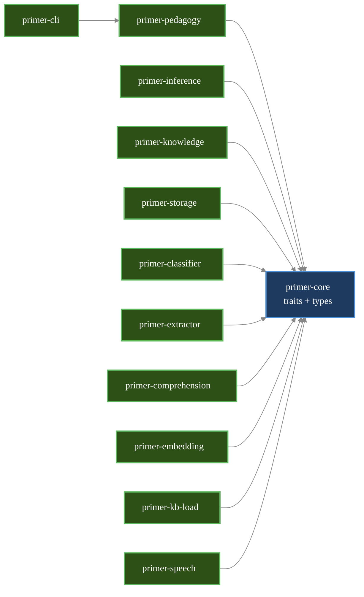

# Developer/Contributor Manual Implementation Plan

> **For agentic workers:** REQUIRED SUB-SKILL: Use superpowers:subagent-driven-development (recommended) or superpowers:executing-plans to implement this plan task-by-task. Steps use checkbox (`- [ ]`) syntax for tracking.

**Goal:** Ship a 10-file developer manual in `docs/devel/` that takes an external OSS contributor from "I cloned the repo" to "I can confidently submit a PR to any subsystem", with deep-linkable how-to recipes embedded in their natural chapters.

**Architecture:** Per-subsystem chapter split. Numbered files for deterministic reading order; titles (not numbers) referenced in cross-links. Recipes live as h3 headings inside their natural chapter; the index has a flat "How do I…?" lookup table that deep-links to those recipe anchors. Mermaid diagrams use a manual-wide colour palette (white text on saturated dark fills + brighter strokes) tuned for legibility on both GitHub light and dark themes; an ASCII fallback follows the load-bearing crate-graph diagram.

**Tech Stack:** Plain markdown (CommonMark + GitHub-flavoured). Mermaid for diagrams. No site generator — files are read directly on GitHub or in-IDE.

**Spec:** [docs/superpowers/specs/2026-05-08-developer-manual-design.md](../specs/2026-05-08-developer-manual-design.md). Every task references the relevant spec section.

---

## Conventions enforced by every chapter task

These are checked by the verification step in every chapter task. They come from spec §5.

- **Callouts** use blockquote prefixes: `> **Note:**`, `> **Gotcha:**`, `> **Why:**`, `> **Recipe — <Action>:**` (note the em-dash + space; this drives the GitHub anchor slug).
- **Code references in prose** use markdown links, never bare backticks for paths. Format: `[turn.rs:120](src/crates/primer-pedagogy/src/dialogue_manager/turn.rs#L120)`.
- **Code blocks** are tagged with the language (` ```rust `, ` ```bash `, ` ```sql `, ` ```toml `). For files, the first line is a path comment: `// src/crates/primer-core/src/inference.rs`.
- **Recipe headings** are h3 of the form `### Recipe — Add a new InferenceBackend.` — GitHub auto-generates the anchor `#recipe--add-a-new-inferencebackend`.
- **Mermaid diagrams** start with the standard `%%{init: ...}%%` block from spec §5.4 and use `classDef trait/impl/ext/stub` with the manual-wide palette.

---

## Task 1: Create `docs/devel/` and write `01-getting-started.md`

**Files:**
- Create: `docs/devel/01-getting-started.md`

**Spec reference:** §4.2.

- [ ] **Step 1: Create the directory**

```bash
mkdir -p docs/devel
```

- [ ] **Step 2: Write `01-getting-started.md`**

Required top-level structure (h1 → h2 only; chapter is short enough that h3s aren't needed):

```markdown
# Getting started

Welcome paragraph: who this manual is for, what this chapter covers.

## Prerequisites

- rustup (NOT Homebrew rust)
- (optional) espeak-ng for --speech mode
- (optional) Anthropic API key for cloud backend

> **Gotcha:** Homebrew rust shadows rustup on $PATH and ignores rust-toolchain.toml. The `silero` and `whisper` features need Rust 1.87+. Always invoke as `~/.cargo/bin/cargo` for primer commands, or remove Homebrew rust from $PATH.

## Cloning and the workspace layout

> **Gotcha:** The workspace root is `src/Cargo.toml`, not the repo root. Every cargo command runs from `src/`. There is no `Cargo.toml` at the repo root.

```bash
git clone https://github.com/<org>/primer.git
cd primer/src
cargo build
```

## First run (stub backend, no API key)

```bash
cargo run --bin primer
```

## Cloud backend (Anthropic)

Env-file precedence: project-local `.env` (searched up from cwd) overrides user-global `~/.primer_env`.

```bash
cp ../.env.example ../.env
# edit ../.env to add ANTHROPIC_API_KEY=...
cargo run --bin primer -- --backend cloud --name Binti --age 8
```

## Ollama backend

```bash
cargo run --bin primer -- --backend ollama --model llama3.2
```

## Embeddings (hybrid retrieval)

> **Note:** First run downloads BGE-M3 (~570 MB) into `~/.cache/primer/models/`. This is expected, not a hang.

```bash
cargo run --bin primer --features primer-cli/embedding -- --embedder-backend fastembed
```

## Voice mode (speech)

> **Gotcha:** `--speech` requires system espeak-ng. macOS: `brew install espeak-ng`. Debian/Ubuntu: `apt install espeak-ng-data`.

```bash
cargo run --bin primer --features primer-cli/speech -- \
  --speech \
  --whisper-model <path>.bin \
  --voice-onnx <path>.onnx \
  --voice-config <path>.onnx.json \
  --voice <model-id>
```

## Tests, logging, verbose output

```bash
cargo test                              # all tests
cargo test -p primer-pedagogy           # one crate
cargo test -p primer-pedagogy decide    # by substring
RUST_LOG=debug cargo run --bin primer
cargo run --bin primer -- --verbose     # pedagogy-flow tracing on stderr
```

## Where session data lives

`~/.primer/<slugified-name>.db` by default. Pass `--no-persist` for in-memory only.

## What to read next

→ [02-architecture-overview.md](02-architecture-overview.md) for the big picture.
→ [09-contributing.md](09-contributing.md) for PR workflow.
```

- [ ] **Step 3: Verify required headings are present**

```bash
grep -c '^## ' docs/devel/01-getting-started.md
# Expected: 8 (Prerequisites, Cloning..., First run, Cloud, Ollama, Embeddings, Voice, Tests..., Where..., What...)
# Actually 9 — adjust grep count match accordingly
```

```bash
grep -c '> \*\*Gotcha:' docs/devel/01-getting-started.md
# Expected: ≥ 3
```

- [ ] **Step 4: Commit**

```bash
git add docs/devel/01-getting-started.md
git commit -m "docs(devel): getting-started chapter"
```

---

## Task 2: Write `02-architecture-overview.md` (with mermaid crate graph)

**Files:**
- Create: `docs/devel/02-architecture-overview.md`

**Spec reference:** §4.3, §5.4 (mermaid styling).

- [ ] **Step 1: Write the chapter**

Required structure:

```markdown
# Architecture overview

## The central design principle

Trait-based hardware abstraction. Backend selection is a runtime config choice, not a code change. This is what allows Phase 0 (cloud) to share code with Phase 1 (local NPU) and Phase 2 (voice).

## The crate graph

The workspace is twelve crates organised in three layers: a binary at the top, a pedagogical engine in the middle, and a constellation of trait-implementing crates at the bottom that all depend on `primer-core` (which defines every public trait).

> **Legend:** blue = trait/interface (defined in `primer-core`); green = concrete implementation; amber = external boundary (HTTP, filesystem, vendor); grey = stub / test-only.



ASCII fallback for environments where mermaid does not render:

```
primer-cli  →  primer-pedagogy  →  primer-core  ←  primer-inference, primer-speech, primer-knowledge, primer-storage, primer-classifier, primer-comprehension, primer-extractor, primer-embedding, primer-kb-load
```

## Crate-by-crate

| Crate | Owns | Chapter |
|---|---|---|
| `primer-core` | every trait + shared types + consts + i18n + retry | §3-§7 |
| `primer-inference` | `InferenceBackend` impls (stub, cloud, ollama) | [03](03-inference-and-pedagogy.md) |
| `primer-pedagogy` | `DialogueManager`, `prompt_builder`, `decide_intent` | [03](03-inference-and-pedagogy.md) |
| `primer-knowledge` | `SqliteKnowledgeBase`, FTS5 + hybrid retrieval | [04](04-knowledge-and-retrieval.md) |
| `primer-embedding` | `Embedder` impls (stub, fastembed, ollama) | [04](04-knowledge-and-retrieval.md) |
| `primer-kb-load` | JSONL ingestion, auto-seed, `--reembed` | [04](04-knowledge-and-retrieval.md) |
| `primer-storage` | `SessionStore`, `LearnerStore`, schema migrations | [05](05-storage-and-sessions.md) |
| `primer-classifier` | engagement classifier | [06](06-classifiers-and-learner-model.md) |
| `primer-extractor` | concept extractor | [06](06-classifiers-and-learner-model.md) |
| `primer-comprehension` | comprehension classifier | [06](06-classifiers-and-learner-model.md) |
| `primer-speech` | VAD/STT/TTS impls + speech_loop helpers | [07](07-speech-and-voice-loop.md) |
| `primer-cli` | the REPL binary `primer` | [03](03-inference-and-pedagogy.md), [08](08-testing-and-debugging.md) |

## The four pedagogical principles

These are constraints on every change; if a change makes the Primer more answer-y or more engagement-maximising, it is wrong.

1. The Primer asks more questions than it answers; pure factual questions get a direct answer, then a Socratic pivot.
2. The Primer never tries to maximise engagement. It detects frustration/disengagement and offers breaks, scaffolding, or session close — never guilt.
3. All learner data is local; cloud inference sends turns per-request only.
4. Comprehension is verified through transfer questions, application, and contradiction probing — not assumed from a confident-sounding response.

## Status

→ [README.md](../../README.md) for what works today.
→ [ROADMAP.md](../../ROADMAP.md) for the phase plan.
→ [primer_technical_spec.md](../../primer_technical_spec.md) for the long-form vision.
```

- [ ] **Step 2: Verify mermaid block + ASCII fallback + 12-row table**

```bash
grep -c '```mermaid' docs/devel/02-architecture-overview.md
# Expected: 1
grep -c '^| primer-' docs/devel/02-architecture-overview.md
# Expected: 12
```

- [ ] **Step 3: Commit**

```bash
git add docs/devel/02-architecture-overview.md
git commit -m "docs(devel): architecture overview with crate graph"
```

---

## Task 3: Write `03-inference-and-pedagogy.md`

**Files:**
- Create: `docs/devel/03-inference-and-pedagogy.md`

**Spec reference:** §4.4. Two recipes required.

- [ ] **Step 1: Write the chapter**

Required structure:

```markdown
# Inference and pedagogy

## The `InferenceBackend` trait

(Describe the three required methods: `generate`, `generate_stream`, `summarize`. Show the trait signature with a code-reference link to [inference.rs](src/crates/primer-core/src/inference.rs).)

## The three concrete backends

### `StubBackend`
Canned Socratic responses, no model. The fallback path that lets the REPL run with no API key.

### `CloudBackend` (Anthropic SSE)
Hand-rolled `SseBuffer` + `parse_anthropic_event`. `Role::System` is mapped to `"user"` in the messages array because the Anthropic API has system instructions as a top-level field. Link to [cloud.rs](src/crates/primer-inference/src/cloud.rs).

### `OllamaBackend` (NDJSON)
`NdjsonBuffer` + `parse_ollama_line`. Prepends a `system`-role message because Ollama's chat API has no separate system field. Link to [ollama.rs](src/crates/primer-inference/src/ollama.rs).

> **Gotcha:** The two backends differ in how they handle system messages. Watch this divergence when reworking prompt assembly.

## The retry layer

Pre-stream only — once `generate_stream` starts consuming bytes from a 2xx response, mid-stream errors propagate cleanly and the partial Primer turn drops at the dialogue-manager layer. Both backends wrap the pre-stream phase in `primer_core::retry::retry_with_backoff`. The retry helper is HTTP-neutral; backends translate their own status codes via `classify_anthropic_status` / `classify_ollama_status` before invoking it. Defaults: 3 attempts × ~250 ms × 2 ≈ ~1.75 s worst case before failure.

## The typed `InferenceError`

Six variants: `Auth`, `RateLimited`, `ServiceUnavailable`, `NetworkUnavailable`, `ModelNotFound`, `Other`.

> **Why:** `Other`'s inner string is dev-facing only — it never reaches users. The i18n layer in `primer_core::i18n::render_inference_error` substitutes a generic message and the call site logs the full error via `tracing::warn!`.

## `DialogueManager`

Lives at [dialogue_manager/](src/crates/primer-pedagogy/src/dialogue_manager/). Directory module split by axis:

- `mod.rs` — struct + glue
- `lifecycle.rs` — new / open / resume / close
- `turn.rs` — `respond_to_streaming` orchestrator + 7 private helpers
- `background.rs` — await/drain/apply for classifier+extractor+comprehension tasks
- `retrieval.rs` — knowledge + long-term-memory retrieval
- `summary.rs` — refresh-summary cadences
- `learner_update.rs` — engagement-state heuristic (placeholder)
- `apply.rs` — pure free fns + their unit tests

When adding a new method, place it in the file matching its responsibility and use `pub(super)` visibility for cross-module access.

## `decide_intent()`

The brain of the Socratic behaviour. Lives in [prompt_builder/](src/crates/primer-pedagogy/src/prompt_builder/). The most important function to test rigorously when adding pedagogical features. Characterization tests in `prompt_builder::tests` pin current behaviour (18 tests at time of writing).

> **Note:** When you change intent routing, add a characterization test for the new branch BEFORE the implementation. The test pins the routing case and prevents regression.

---

### Recipe — Add a new `InferenceBackend`

Worked example: adding a hypothetical `OpenAIBackend`.

1. **Implement the trait.** Create `primer-inference/src/openai.rs`. Implement `generate`, `generate_stream`, `summarize`.
2. **Hand-roll the streaming.** OpenAI uses SSE like Anthropic; reuse `SseBuffer` (or implement your own `parse_*_event`). Forward chunks via `futures::channel::mpsc::unbounded` driven by a spawned tokio task.
3. **Map errors to `InferenceError`.** Add a `classify_openai_status(status: StatusCode) -> InferenceError` helper. Map 401 → `Auth`, 429 → `RateLimited` (parse `Retry-After`), 404 → `ModelNotFound`, 5xx → `ServiceUnavailable`, network → `NetworkUnavailable`, everything else → `Other`. Never embed user-facing strings in the variants.
4. **Wrap the pre-stream phase in `retry_with_backoff`.** Pattern from `cloud.rs`:

```rust
// src/crates/primer-inference/src/openai.rs
let resp = retry_with_backoff(retry_settings, || async {
    let r = client.post(&url).headers(headers.clone()).json(&body).send().await?;
    classify_openai_status(r.status()).map(|err| Err(err))?;
    Ok(r)
}).await?;
```

5. **Register in `primer-cli`.** Add an `OpenAi` variant to the `Backend` enum in `primer-cli/src/backend.rs`. Wire construction in the factory function.
6. **Add the `--backend openai` clap variant.** Plus `--openai-api-key` (or env var fallback) following the `--api-key` pattern.
7. **Write integration tests.** Stub the HTTP layer with `wiremock` or similar. Test: success → chunks arrive in order; 429 → retry honours `Retry-After`; mid-stream disconnect → error propagates without recording the partial turn.
8. **Update `README.md`** to mention the new backend in the supported-backends list.

### Recipe — Add a new `PedagogicalIntent`

Worked example: adding `Celebrate` (acknowledge a breakthrough moment).

1. **Add the variant to the enum.** Edit `primer-core/src/intent.rs`:

```rust
// src/crates/primer-core/src/intent.rs
pub enum PedagogicalIntent {
    // ...existing variants...
    Celebrate = 10,
}
```

The integer value is the lookup-table id. Pick the next unused id — never reuse a retired one (see [05-storage-and-sessions.md](05-storage-and-sessions.md) for why).

2. **Add a routing branch in `decide_intent`.** In [prompt_builder/decide_intent.rs](src/crates/primer-pedagogy/src/prompt_builder/decide_intent.rs), add the heuristic that routes to `Celebrate`. Keep it deterministic — engagement-state overrides should still win.

3. **Extend the prompt builder.** In `build_system_prompt_with_pack_and_vocab`, add a section for the `Celebrate` intent describing how the Primer should celebrate (briefly, then pivot back to inquiry — never break principle 2).

4. **Add a characterization test.** In `prompt_builder::tests`:

```rust
// src/crates/primer-pedagogy/src/prompt_builder/tests.rs
#[test]
fn celebrate_when_child_makes_correct_synthesis() {
    let intent = decide_intent(&fixture_for_synthesis_moment());
    assert_eq!(intent, PedagogicalIntent::Celebrate);
}
```

5. **Open any test session DB.** The lookup-table seeder in `primer-storage` validates the in-DB rows against the Rust enum on every `open()`; a new variant gets seeded automatically. No migration step required for the enum addition itself.

6. **Update the CLAUDE.md gotcha** if the new intent has cross-cutting behaviour.

---

(remaining sections: see spec §4.4)
```

- [ ] **Step 2: Verify two recipe headings exist**

```bash
grep -c '^### Recipe — ' docs/devel/03-inference-and-pedagogy.md
# Expected: 2
```

- [ ] **Step 3: Verify load-bearing internal links**

```bash
grep -c '02-architecture-overview\|05-storage-and-sessions\|src/crates/primer-' docs/devel/03-inference-and-pedagogy.md
# Expected: ≥ 5
```

- [ ] **Step 4: Commit**

```bash
git add docs/devel/03-inference-and-pedagogy.md
git commit -m "docs(devel): inference & pedagogy chapter"
```

---

## Task 4: Write `04-knowledge-and-retrieval.md`

**Files:**
- Create: `docs/devel/04-knowledge-and-retrieval.md`

**Spec reference:** §4.5. Two recipes required.

- [ ] **Step 1: Write the chapter**

Required sections (each as h2 unless noted):

- `# Knowledge and retrieval`
- `## The KnowledgeBase trait` — show signature; reference [knowledge.rs](src/crates/primer-core/src/knowledge.rs).
- `## SqliteKnowledgeBase schema` — per-locale `passages_<pack_id>` (FTS5) + `passages_<pack_id>_meta` + `embeddings_<pack_id>`. Cross-locale: `sources`, `embedding_models`. Schema at user_version 3.
- `## BM25 ranking` — explain the negative-rank flip in the public API.
- `## Hybrid retrieval` — `retrieve_hybrid`, BM25 leg + dense-vector cosine leg, RRF fusion, `HybridParams::default()` from `primer_core::consts::retrieval`. Mermaid sub-diagram showing the two-leg fusion is OPTIONAL but recommended.
- `## The Embedder trait` — three impls (`StubEmbedder`, `FastEmbedBackend`, `OllamaEmbedder`). Discuss the `embedding_models` invariant.
- `## Auto-seed and multi-file discovery` — `$PRIMER_SEED_DIR` → `$XDG_DATA_HOME/primer/seed/` → walking up from `CARGO_MANIFEST_DIR`. Lexicographic load order. Multi-layer corpus.
- `## Wikipedia ingestion pipeline` — `data/ingest/`, Python, network as test boundary. How to regenerate. Whitelist hand-curation.
- `## Sweep tests` — BM25-only at `tests/retrieval_sweep.rs`, hybrid at `tests/retrieval_sweep_hybrid.rs`. Tuned defaults.

Required callouts (≥ 4):

- `> **Gotcha:**` — `--embedder-backend stub` is for testing only; in production it dilutes BM25 with hash noise.
- `> **Gotcha:**` — first-run BGE-M3 download is ~570 MB; falls back to BM25-only with a `tracing::warn!` if the download fails.
- `> **Gotcha:**` — `embedding` and `speech` features both pin `ort = "=2.0.0-rc.10"`; bumping fastembed past 5.7.0 will break the speech build.
- `> **Note:**` — when no `Embedder` is wired, `retrieve_hybrid`'s default trait impl falls back to BM25-only, so every consumer can call it unconditionally.

Required recipes (h3, two of them):

`### Recipe — Add or tune seed passages`

Steps:
1. Edit `data/seed/seed_passages.<pack>.jsonl` (or add a new layer file `*.<pack>.jsonl`). Each entry needs `id`, `body`, `source` attribution.
2. Add (or update) the corresponding row in the `sources` table seeding logic if the licence/attribution is new.
3. Run `cargo test -p primer-knowledge --test retrieval_sweep` to check BM25-only recall hasn't regressed.
4. Run `cargo test -p primer-knowledge --test retrieval_sweep_hybrid --features fastembed --ignored` to check hybrid recall hasn't regressed.
5. If a previously failing query now resolves, remove its entry from `KNOWN_FAILING_QUERIES` / `KNOWN_FAILING_QUERIES_HYBRID` in `tests/common/mod.rs`.
6. Commit the JSONL change AND the test-list change in one commit.

Show the JSONL row format:

```jsonl
{"id":"sun_shine_01","body":"The Sun shines because of nuclear fusion in its core...","source":"hand-drafted-cc0"}
```

`### Recipe — Add a new locale`

Steps:
1. Add `Locale` variant to `primer-core/src/i18n.rs`. Pick a stable string id (`"de"`, `"ja"`).
2. Add a TOML pack file under `primer-core/i18n/<id>.toml` mirroring `en.toml`. Every locale-specific user-visible string lives here, including `break_suggestion_intro` with a locale-appropriate `{minutes}` substitution.
3. Add seed JSONL: `data/seed/seed_passages.<id>.jsonl` (and optionally `wiki_passages.<id>.jsonl` regenerated via `data/ingest/`).
4. Open the KB with `SqliteKnowledgeBase::open_for_locale(path, locale)`. No migration step — locale-scoped tables are created on demand.
5. Test the locale guard on `--resume`: opening a session with a different `--language` than the stored learner locale must error with the two-resolution hint.
6. Run `cargo test -p primer-pedagogy locale` and `cargo test -p primer-knowledge locale` to confirm locale-scoping invariants.
7. (Cross-link) See [05-storage-and-sessions.md](05-storage-and-sessions.md) for the per-learner `learners.locale` field that stores the locale alongside the session.

- [ ] **Step 2: Verify recipe count and seed-discovery mention**

```bash
grep -c '^### Recipe — ' docs/devel/04-knowledge-and-retrieval.md
# Expected: 2
grep -c 'PRIMER_SEED_DIR\|XDG_DATA_HOME' docs/devel/04-knowledge-and-retrieval.md
# Expected: ≥ 1 (each)
```

- [ ] **Step 3: Commit**

```bash
git add docs/devel/04-knowledge-and-retrieval.md
git commit -m "docs(devel): knowledge & retrieval chapter"
```

---

## Task 5: Write `05-storage-and-sessions.md`

**Files:**
- Create: `docs/devel/05-storage-and-sessions.md`

**Spec reference:** §4.6. One recipe required.

- [ ] **Step 1: Write the chapter**

Required sections:

- `# Storage and sessions`
- `## Privacy split` — per-child session DB at `~/.primer/<slug>.db`, separate from RAG corpus.
- `## SessionStore and LearnerStore traits` — show signatures.
- `## Schema-migration pattern` — idempotent `CREATE IF NOT EXISTS` and `pragma_table_info` ALTER guards, transaction-wrapped, version bump, drift validation against Rust enums on every `open()`.
- `## Lookup-table normalisation` — every categorical text column is a foreign key; closed Rust enums are the source of truth; the DB seeder regenerates and validates on every open. **Drift is a hard error.** Adding a new variant means: edit the Rust source → recompile → next `open()` seeds the row. **Retired integer IDs are never reused.**
- `## The append-only invariant on save_session` — and why `update_turn_concepts` exists as the explicit backfill path. Don't move concept persistence back into `save_session`.
- `## FTS5 query sanitisation` — `sanitize_fts_phrase`, OR-join with quoted tokens, BM25 + `LIMIT k`. This is what allows `retrieve_session_turns` to take raw child input safely.
- `## Long-term memory layered into the system prompt` — chat timeline stays linear; summary + retrieved-older turns inject into system prompt.
- `## Turn-embedding-on-save` — `tokio::spawn`, fire-and-forget. Idempotent at the storage layer.
- `## Schema versions, in order` — table summarising v2 through v8. One line per migration.

Required callouts (≥ 3):

- `> **Why:**` — Privacy split: per-child session DBs are separate from the RAG corpus because they contain conversational PII; never merge them.
- `> **Gotcha:**` — Drift in lookup tables is a hard error. There is no API for mutating lookup tables. Adding a variant means recompile + reopen.
- `> **Gotcha:**` — Schema USER_VERSION newer than this build is a hard error (rejected on open). Older is silently upgraded.

Required recipe:

`### Recipe — Add a schema migration`

Steps:
1. **Bump `USER_VERSION` in `primer-storage/src/schema.rs`.** From N to N+1.
2. **Add `apply_vN1_migrations`** following the v7/v8 template. Show full annotated example using a real recent migration as the model. Wrap the body in `conn.unchecked_transaction()`. Use `CREATE TABLE IF NOT EXISTS` and `pragma_table_info`-guarded `ALTER TABLE`.

```rust
// src/crates/primer-storage/src/schema.rs
fn apply_v9_migrations(conn: &Connection) -> Result<()> {
    let tx = conn.unchecked_transaction()?;

    if !column_exists(&tx, "turns", "vibe")? {
        tx.execute(
            "ALTER TABLE turns ADD COLUMN vibe INTEGER NOT NULL DEFAULT 0",
            [],
        )?;
    }

    tx.execute(
        "CREATE TABLE IF NOT EXISTS vibes (
            id INTEGER PRIMARY KEY,
            name TEXT NOT NULL UNIQUE
        )",
        [],
    )?;

    tx.commit()?;
    Ok(())
}
```

3. **Wire it into the open path** in `SqliteSessionStore::open` — call after the v8 path, before drift validation.
4. **Add a migration round-trip test.** `tests/migration_v8_to_v9.rs`: open a fixture v8 DB → assert `user_version` becomes 9 → assert new schema present → assert old data preserved.
5. **If the migration touches an enum-backed lookup table**, extend the drift-validation `seed_and_validate_*` helper in `lookup_tables.rs`.
6. **Update CLAUDE.md** — there's a "Schema is at version N" line; bump it.

- [ ] **Step 2: Verify recipe + schema-version table**

```bash
grep -c '^### Recipe — ' docs/devel/05-storage-and-sessions.md
# Expected: 1
grep -E 'v[2-8]' docs/devel/05-storage-and-sessions.md | wc -l
# Expected: ≥ 7 (one mention per version)
```

- [ ] **Step 3: Commit**

```bash
git add docs/devel/05-storage-and-sessions.md
git commit -m "docs(devel): storage & sessions chapter"
```

---

## Task 6: Write `06-classifiers-and-learner-model.md`

**Files:**
- Create: `docs/devel/06-classifiers-and-learner-model.md`

**Spec reference:** §4.7. One recipe required.

- [ ] **Step 1: Write the chapter**

Required sections:

- `# Classifiers and the learner model`
- `## The structured-output trio` — engagement classifier, concept extractor, comprehension classifier. All three follow the same shape: `Trait`, `Llm*Impl` (wraps `Arc<dyn InferenceBackend>`), `Stub*` (with `with_response`/`with_script`).
- `## The spawn / await / detach-on-timeout pattern` — applied identically across all three. Diagram (mermaid) showing the timing relative to the conversational turn loop.
- `## Soft-fail discipline` — classifier/extractor/comprehension errors NEVER propagate; log via `tracing::warn!` and return empty/unknown.
- `## The chain inside the dialogue manager` — `(classifier task) || (extractor → comprehension chain)`. Combined timeout. Why both lag one turn for in-memory state but not for DB persistence.
- `## The LearnerModel umbrella` — `LearnerProfile` + `Vec<ConceptState>` + `LearningPreferences` + latest engagement snapshot. Edit the leaf, not the umbrella. `LearningPreferences` serialises as JSON (open-vocabulary); categorical leaves are closed enums backed by lookup tables.
- `## apply_comprehension is monotonic-max` — a weak exchange never demotes depth; explicit forgetting is a future concern.
- `## Vocabulary spaced repetition` — `primer_core::vocab::apply_box_transition`, `due_concepts`, Leitner intervals `[1d, 3d, 7d, 14d, 30d]`. Driven by the comprehension classifier, no extra LLM call. Vocab entries ARE `ConceptState` rows — not a separate table.
- `## Shared utilities` — `extract_first_json_object`, `truncate_to_chars` in `primer_core::llm_util`. Don't reintroduce per-crate copies.

Required callouts (≥ 3):

- `> **Gotcha:**` — Classifier/extractor/comprehension errors NEVER propagate. If you find yourself adding `?` on one of their results, you have a bug.
- `> **Gotcha:**` — Concepts and comprehension lag one turn for in-memory state. Per-turn DB rows are written immediately; the in-memory `LearnerModel.concepts` only updates at the start of the next turn.
- `> **Why:**` — `LearningPreferences` is JSON because children's interests don't fit a closed enum; `UnderstandingDepth` is a closed enum because depth has a fixed semantic ladder.

Required recipe:

`### Recipe — Add a structured-output classifier`

Worked example: a hypothetical "tone classifier" that scores child turns on a `cheerful/neutral/anxious` ladder.

Steps (9 total):

1. **Define the trait in your new crate `primer-tone`** following the pattern at [primer-classifier/src/lib.rs](src/crates/primer-classifier/src/lib.rs). Declare an associated output type `ToneAssessment { tone: ToneState, confidence: f32 }`.

2. **Implement `LlmToneClassifier`** wrapping `Arc<dyn InferenceBackend>`. Use `extract_first_json_object` from `primer_core::llm_util` to parse the model's response. Use `truncate_to_chars` to bound the input.

```rust
// src/crates/primer-tone/src/llm.rs
let raw = backend.generate(&prompt, params).await
    .map_err(|e| { tracing::warn!(target: "primer::tone", "{e}"); e })
    .ok();
let json = raw.as_deref().and_then(extract_first_json_object);
let assessment = json.and_then(|s| serde_json::from_str(&s).ok())
    .unwrap_or_else(ToneAssessment::unknown_low_confidence);
```

3. **Implement `StubToneClassifier`** with `with_response(ToneAssessment)` and `with_script(VecDeque<ToneAssessment>)` constructors. Used for tests.

4. **Add `ToneSettings`** with every numeric (timeout, recent_context_turns, max_output_chars, confidence_threshold, generation_*) backed by constants in `primer-core/src/consts.rs`. Never inline numerics — that's a project-wide rule.

5. **Add a schema migration** if you need to persist (link to chapter 05). For tone, you'd add `turn_tones` UNIQUE on `(turn_id, classifier_id)`, plus a `tone_classifiers` registry.

6. **Wire the spawn/await pattern** into `DialogueManager`'s `background.rs` following the classifier model. Hold the classifier as `Arc<dyn ToneClassifier>` because spawn requires `'static`.

7. **Add CLI flags** following the `--classifier-*` template: `--tone-backend`, `--tone-model`, `--tone-timeout-ms`. Default to mirroring the main `--backend` / `--model`.

8. **Soft-fail tracing.** Confirm every error path inside `LlmToneClassifier` produces a `tracing::warn!` and returns `ToneAssessment::unknown_low_confidence(...)`. Never return `Result::Err` from the public API.

9. **Tests.** Stub-driven: feed a script of canned `ToneAssessment`s, drive a mock dialogue, assert the persistence row + the in-memory state at the next turn.

- [ ] **Step 2: Verify recipe + soft-fail callout**

```bash
grep -c '^### Recipe — ' docs/devel/06-classifiers-and-learner-model.md
# Expected: 1
grep -c 'soft-fail\|Soft-fail' docs/devel/06-classifiers-and-learner-model.md
# Expected: ≥ 2
```

- [ ] **Step 3: Commit**

```bash
git add docs/devel/06-classifiers-and-learner-model.md
git commit -m "docs(devel): classifiers & learner-model chapter"
```

---

## Task 7: Write `07-speech-and-voice-loop.md`

**Files:**
- Create: `docs/devel/07-speech-and-voice-loop.md`

**Spec reference:** §4.8. One recipe required.

- [ ] **Step 1: Write the chapter**

Required sections:

- `# Speech and the voice loop`
- `## The five speech traits and the Named base trait` — `VoiceActivityDetector`, `SpeechToText` + `StreamingSpeechToText`, `TextToSpeech` + `StreamingTextToSpeech`. All inherit from `Named` so backends write `name()` once.
- `## Concrete backends and feature gates` — stubs always built; real backends behind `silero`, `whisper`, `piper`, `cpal` features.
- `## Why piper-rs is vendored at src/vendor/piper-rs/` — the `ort 2.0.0-rc.10` patch (three call sites). `[patch.crates-io]` directive in `src/Cargo.toml`.
- `## Why silero-vad-rust is vendored at src/vendor/silero-vad-rust/` — three patches: `is_multiple_of`, removed `load-dynamic` from ort features, crate-level `#![allow(...)]`.
- `## The speech_loop state machine` — LISTEN → THINK → SPEAK → LISTEN. No barge-in in either direction.
- `## The is_speaking AtomicBool` — gates the audio thread during SPEAK. The `DrainHook` spawn_blocking pattern; why `std::thread::sleep` directly inside on_audio would deadlock the runtime.
- `## Speaker ringbuf sizing` — 240,000 samples ≈ 5s at 48kHz. Never shrink.
- `## Markdown-stripping for TTS` — `strip_markdown_for_tts` removes paired markers; bare unmatched stay; digit-flanked `*` becomes " times ".
- `## The dedicated audio-capture thread` — std::thread, not tokio task. Owns silero VAD + active whisper session.
- `## Resampler tail-handling` — leftover buffer + flush sentinel + 4-chunk silence drain pulse.
- `## espeak-ng requirement and probe` — `/opt/homebrew/share`, `/usr/local/share`, `/usr/share`. Sets `PIPER_ESPEAKNG_DATA_DIRECTORY`.

Required callouts (≥ 4):

- `> **Gotcha:**` — Build with rustup, not Homebrew rust. Repeat from chapter 01 because speech is where the bug surfaces hardest.
- `> **Gotcha:**` — Pass `--voice <model-id>` matching the .onnx filename, or Piper rejects with model-id mismatch.
- `> **Gotcha:**` — Never shrink the speaker ringbuf below 240,000 samples; the previous 24,000-sample buffer dropped phrases.
- `> **Why:**` — No barge-in is pedagogical, not a POC limitation. Learning to listen is part of the educational experience.

Required recipe:

`### Recipe — Add a speech backend`

Steps:
1. **Pick the trait.** `VoiceActivityDetector` (audio frames in, speech-state-events out), `SpeechToText` (audio in, text out), or `TextToSpeech` (text in, audio out). Streaming variants extend the one-shot.
2. **Implement it.** `Named::name()` is written once via the auto-impl pattern. Show the trait skeleton.
3. **Gate behind a cargo feature** in `primer-speech/Cargo.toml`. Naming: lowercase backend name (`whisper`, `piper`).
4. **Vendor or patch incompatible deps** under `src/vendor/<crate>/` and add `[patch.crates-io] <crate> = { path = "vendor/<crate>" }` in `src/Cargo.toml`. The vendored copy carries the smallest possible patch — preserve upstream attribution and history.
5. **Wire into `LoopBackends`** in `primer-cli/src/speech_loop/`. The factory function selects backends from CLI flags.
6. **Add a smoke example** in `src/examples/` (e.g. `tts_hello.rs`). One-shot binary that exercises the backend without the full REPL.
7. **Add system-dep installation notes to [08-testing-and-debugging.md](08-testing-and-debugging.md)** if your backend needs a system package.

- [ ] **Step 2: Verify vendor-patch sections + recipe**

```bash
grep -c 'vendor/piper-rs\|vendor/silero-vad-rust' docs/devel/07-speech-and-voice-loop.md
# Expected: ≥ 2
grep -c '^### Recipe — ' docs/devel/07-speech-and-voice-loop.md
# Expected: 1
```

- [ ] **Step 3: Commit**

```bash
git add docs/devel/07-speech-and-voice-loop.md
git commit -m "docs(devel): speech & voice-loop chapter"
```

---

## Task 8: Write `08-testing-and-debugging.md`

**Files:**
- Create: `docs/devel/08-testing-and-debugging.md`

**Spec reference:** §4.9. One recipe required, plus the "common pitfalls" parade (a Gotcha catalogue).

- [ ] **Step 1: Write the chapter**

Required sections:

- `# Testing and debugging`
- `## Test layout` — per-crate `tests/`, shared mocks in `test_support.rs`, characterization tests for `decide_intent`, sweep tests for retrieval, dialogue-manager tests split per axis (lifecycle, turn, background).
- `## Running tests` — full / single crate / by substring; `--features` matrix for feature-gated crates (`fastembed`, `speech`).
- `## RUST_LOG and --verbose` — when each is right. Line format: `[intent]`, `[classifier]`, `[extractor]`, `[comprehension]` on stderr.
- `## Inspecting session DBs` — `sqlite3 ~/.primer/<slug>.db`. Useful queries shown as code blocks: most-recent session, recent turn classifications, recent comprehensions.
- `## Common pitfalls` — the gotcha parade (≥ 8 entries from spec §4.9).
- `## Debugging a streaming hang` — where to add tracing in the streaming buffer.
- `## Debugging a quiet classifier/extractor/comprehension` — feeds into the recipe.

Required code blocks (≥ 3 sqlite query examples):

```sql
-- most-recent session
SELECT id, started_at, turn_count FROM sessions ORDER BY started_at DESC LIMIT 1;
-- recent classifications
SELECT t.idx, c.engagement_state, c.confidence FROM turn_classifications c
  JOIN turns t ON t.id = c.turn_id WHERE c.session_id = ?1 ORDER BY t.idx DESC LIMIT 5;
-- recent comprehensions
SELECT t.idx, co.name, c.depth, c.confidence FROM turn_comprehensions c
  JOIN turns t ON t.id = c.turn_id JOIN concepts co ON co.id = c.concept_id
  WHERE c.session_id = ?1 ORDER BY t.idx DESC, c.confidence DESC LIMIT 10;
```

Required gotchas (≥ 8, each as a `> **Gotcha:**` callout):

- Homebrew rust shadowing rustup → use `~/.cargo/bin/cargo`.
- `cargo build` failed because you ran it from the repo root, not `src/`.
- `--speech` panics with espeak data error → install `espeak-ng`.
- `--embedder-backend fastembed` errors → enable the `embedding` feature.
- First run of fastembed downloads ~570 MB → expected, not a hang.
- First run of `--speech` downloads ONNX runtime → expected, not a hang.
- Voice rejected with model-id mismatch → pass `--voice <model-id>`.
- Streaming hangs → check 2xx-with-no-body; mid-stream errors should propagate.

Required recipe:

`### Recipe — Diagnose a quiet classifier`

Symptoms: `--verbose` is on but no `[classifier]` line is printed; `turn_classifications` is empty.

Steps:
1. **Confirm `--verbose` is set.** Without it, the line never prints even on success.
2. **Look for the `[classifier]` line on stderr** for the most recent turn. If absent, the classifier task isn't completing within the timeout.
3. **Inspect `turn_classifications` for the most recent session.**

```sql
SELECT COUNT(*) FROM turn_classifications WHERE session_id = ?1;
```

If 0, the classifier never wrote a row.

4. **Increase `--classifier-timeout-ms`.** Default is 3000ms. Small models need more time, especially when chained behind extractor+comprehension.
5. **Swap to `--classifier-backend stub`** to confirm the integration point. If stub-backed classifier writes rows, the LLM call itself is the bottleneck; if not, the integration is broken.

- [ ] **Step 2: Verify gotcha count + recipe**

```bash
grep -c '> \*\*Gotcha:' docs/devel/08-testing-and-debugging.md
# Expected: ≥ 8
grep -c '^### Recipe — ' docs/devel/08-testing-and-debugging.md
# Expected: 1
```

- [ ] **Step 3: Commit**

```bash
git add docs/devel/08-testing-and-debugging.md
git commit -m "docs(devel): testing & debugging chapter"
```

---

## Task 9: Write `09-contributing.md`

**Files:**
- Create: `docs/devel/09-contributing.md`

**Spec reference:** §4.10.

- [ ] **Step 1: Write the chapter**

Required sections:

- `# Contributing`
- `## Repo workflow` — fork, branch naming (`feature/...`, `fix/...`), PR conventions.
- `## Commit conventions` — conventional commits (`feat:`, `fix:`, `docs:`, `refactor:`, `test:`); no `--no-verify`; no `--amend` after push.
- `## Code style` — `cargo fmt` + `cargo clippy --workspace --all-targets`. CI runs both.
- `## No magic numbers` — every numeric goes to `primer-core::consts` (if invariant) or a per-subsystem `*Settings` struct (if tunable). Never inline.
- `## Categorical text columns are normalised` — link to chapter 05.
- `## Where to find open work` — [ROADMAP.md](../../ROADMAP.md), GitHub Issues, `// TODO` markers, [SPECULATIONS_AND_IDEAS.md](../../SPECULATIONS_AND_IDEAS.md).
- `## How to ask for review` — PR template, what reviewers check (clippy clean, tests added, CLAUDE.md updated if conventions changed).
- `## License` — link to [LICENSE](../../LICENSE).

Required commands shown in code blocks:

```bash
cd src
cargo fmt
cargo clippy --workspace --all-targets -- -D warnings
cargo test
```

- [ ] **Step 2: Verify load-bearing links**

```bash
grep -c 'ROADMAP\|SPECULATIONS\|LICENSE\|05-storage' docs/devel/09-contributing.md
# Expected: ≥ 4
```

- [ ] **Step 3: Commit**

```bash
git add docs/devel/09-contributing.md
git commit -m "docs(devel): contributing chapter"
```

---

## Task 10: Write `index.md` with the lookup table

**Files:**
- Create: `docs/devel/index.md`

**Spec reference:** §4.1, §5 (conventions appendix).

This task is LAST among chapter writes because the lookup-table anchors must match recipe headings that now exist on disk.

- [ ] **Step 1: Write `index.md`**

Required structure:

```markdown
# Developer / contributor manual

Welcome paragraph: who this manual is for, what it covers, what it doesn't (the "Non-goals" list from spec §1).

## Reading paths

Three suggested orderings:

- **I'm new and want to contribute** → start with [Getting started](01-getting-started.md), then [Architecture overview](02-architecture-overview.md), then [Contributing](09-contributing.md), then pick a subsystem chapter.
- **I want to add feature X** → look up the recipe in the table below.
- **I want to understand subsystem Y** → jump straight to its chapter.

## Chapters

| # | Chapter | What it covers |
|---|---|---|
| 01 | [Getting started](01-getting-started.md) | Clone, build, first run, env files, tests, logging. |
| 02 | [Architecture overview](02-architecture-overview.md) | Trait-based abstraction, the 12-crate graph, pedagogical principles. |
| 03 | [Inference and pedagogy](03-inference-and-pedagogy.md) | `InferenceBackend` impls, `DialogueManager`, `decide_intent`, retry, error i18n. |
| 04 | [Knowledge and retrieval](04-knowledge-and-retrieval.md) | FTS5 + hybrid retrieval, embedders, seed corpus, locales. |
| 05 | [Storage and sessions](05-storage-and-sessions.md) | Session/learner stores, schema migrations, long-term memory. |
| 06 | [Classifiers and learner model](06-classifiers-and-learner-model.md) | Classifier/extractor/comprehension trio, vocab Leitner box. |
| 07 | [Speech and voice loop](07-speech-and-voice-loop.md) | VAD/STT/TTS, vendored crates, speech_loop state machine. |
| 08 | [Testing and debugging](08-testing-and-debugging.md) | Test layout, RUST_LOG, common pitfalls, debugging recipes. |
| 09 | [Contributing](09-contributing.md) | PR workflow, commits, style, where to find open work. |

## How do I…?

| Task | Recipe |
|---|---|
| Add a new `InferenceBackend` | [03-inference-and-pedagogy.md#recipe--add-a-new-inferencebackend](03-inference-and-pedagogy.md#recipe--add-a-new-inferencebackend) |
| Add a new `PedagogicalIntent` | [03-inference-and-pedagogy.md#recipe--add-a-new-pedagogicalintent](03-inference-and-pedagogy.md#recipe--add-a-new-pedagogicalintent) |
| Add or tune seed passages | [04-knowledge-and-retrieval.md#recipe--add-or-tune-seed-passages](04-knowledge-and-retrieval.md#recipe--add-or-tune-seed-passages) |
| Add a new locale | [04-knowledge-and-retrieval.md#recipe--add-a-new-locale](04-knowledge-and-retrieval.md#recipe--add-a-new-locale) |
| Add a schema migration | [05-storage-and-sessions.md#recipe--add-a-schema-migration](05-storage-and-sessions.md#recipe--add-a-schema-migration) |
| Add a structured-output classifier | [06-classifiers-and-learner-model.md#recipe--add-a-structured-output-classifier](06-classifiers-and-learner-model.md#recipe--add-a-structured-output-classifier) |
| Add a speech backend | [07-speech-and-voice-loop.md#recipe--add-a-speech-backend](07-speech-and-voice-loop.md#recipe--add-a-speech-backend) |
| Diagnose a quiet classifier | [08-testing-and-debugging.md#recipe--diagnose-a-quiet-classifier](08-testing-and-debugging.md#recipe--diagnose-a-quiet-classifier) |
| Run / test / debug locally | [08-testing-and-debugging.md](08-testing-and-debugging.md) |

## Conventions used in this manual

- `> **Note:**` — an aside that doesn't change behaviour.
- `> **Gotcha:**` — something that has bitten contributors before. Almost every CLAUDE.md "gotcha" appears as one of these in the relevant chapter.
- `> **Why:**` — rationale for a non-obvious design choice.
- `> **Recipe — <Action>:**` — worked example with numbered steps.

For code references in prose, the manual uses markdown links (`[turn.rs:120](src/crates/primer-pedagogy/src/dialogue_manager/turn.rs#L120)`) — never bare backticks for paths, so the IDE preserves click-through.

Code samples are tagged with the language and (for files) carry a path comment on the first line:

```rust
// src/crates/primer-core/src/inference.rs
pub trait InferenceBackend: Send + Sync {
    async fn generate(&self, prompt: &Prompt, params: GenParams) -> Result<String>;
}
```

## External resources

- [README.md](../../README.md) — product pitch, status.
- [ROADMAP.md](../../ROADMAP.md) — phase plan.
- [primer_technical_spec.md](../../primer_technical_spec.md) — long-form vision.
- [CLAUDE.md](../../CLAUDE.md) — agent-facing conventions and gotchas (the manual mirrors these in contributor-friendly tone).
- [SPECULATIONS_AND_IDEAS.md](../../SPECULATIONS_AND_IDEAS.md) — open ideas, future directions.
```

- [ ] **Step 2: Verify all 9 lookup-table entries land on existing recipe anchors**

For each anchor in the lookup table, grep the target file for the matching `### Recipe — <heading>` and confirm it exists. The slug `recipe--add-a-new-inferencebackend` corresponds to the heading text `Recipe — Add a new InferenceBackend`.

```bash
# Verify every recipe heading exists in its chapter
grep -h '^### Recipe — ' docs/devel/03-*.md docs/devel/04-*.md docs/devel/05-*.md docs/devel/06-*.md docs/devel/07-*.md docs/devel/08-*.md
# Expected output (one line per recipe, 9 total):
#   ### Recipe — Add a new `InferenceBackend`
#   ### Recipe — Add a new `PedagogicalIntent`
#   ### Recipe — Add or tune seed passages
#   ### Recipe — Add a new locale
#   ### Recipe — Add a schema migration
#   ### Recipe — Add a structured-output classifier
#   ### Recipe — Add a speech backend
#   ### Recipe — Diagnose a quiet classifier
```

- [ ] **Step 3: Commit**

```bash
git add docs/devel/index.md
git commit -m "docs(devel): index with lookup table"
```

---

## Task 11: Add the cross-link from `README.md`

**Files:**
- Modify: `README.md`

- [ ] **Step 1: Find the right insertion point**

```bash
grep -n '^## ' README.md | head -20
```

Look for a "Contributing" section or a natural anchor near the bottom. If neither exists, add a new section right before any "License" section.

- [ ] **Step 2: Add the one-line cross-link**

If a Contributing section exists, append:

```markdown
**Developer manual:** see [docs/devel/](docs/devel/) for the full contributor manual — getting started, architecture, subsystem deep-dives, and how-to recipes.
```

If no Contributing section exists, add one:

```markdown
## Contributing

**Developer manual:** see [docs/devel/](docs/devel/) for the full contributor manual — getting started, architecture, subsystem deep-dives, and how-to recipes.
```

- [ ] **Step 3: Commit**

```bash
git add README.md
git commit -m "docs(readme): link to developer manual"
```

---

## Task 12: Final link-and-render verification

**Files:**
- (none modified — verification only)

- [ ] **Step 1: Verify all internal markdown links resolve**

```bash
# For every link of the form ](something), check that the target exists.
# This is a coarse-grained check; intra-doc anchors are not validated by this script.
cd docs/devel && for f in *.md; do
  grep -oE '\]\([^)]+\)' "$f" | sed 's/](\(.*\))/\1/' | while read link; do
    # skip URLs and pure anchors
    case "$link" in
      http*|'#'*) continue;;
    esac
    # split off any anchor
    target="${link%%#*}"
    # resolve relative to docs/devel/
    if [ -n "$target" ] && [ ! -e "$target" ] && [ ! -e "../../$target" ]; then
      echo "BROKEN in $f: $link"
    fi
  done
done
```

Expected: no `BROKEN` lines.

- [ ] **Step 2: Verify mermaid renders**

Open `docs/devel/02-architecture-overview.md` in VS Code's markdown preview (which has built-in mermaid support) AND on GitHub (push the branch first, view in browser, then check both light and dark themes via `?theme=dark` in the URL or your account settings).

Confirm:
- Crate-graph diagram renders.
- Node text is readable (white on dark fill).
- Edges are visible against both backgrounds.

If a diagram fails to render, check the `%%{init: ...}%%` block — most mermaid render failures are JSON syntax errors in the config.

- [ ] **Step 3: Verify recipe anchors round-trip**

Pick one recipe lookup-table entry from `index.md` and confirm clicking it lands on the recipe heading.

Smoke test command:

```bash
# For each anchor in index.md, confirm the heading exists in the target file.
grep -oE '\(\d{2}-[a-z-]+\.md#recipe--[a-z-]+\)' docs/devel/index.md | tr -d '()' | while read ref; do
  file="${ref%%#*}"
  anchor="${ref#*#}"
  # convert anchor back to a heading regex: recipe--add-a-new-locale → "Recipe — Add a new locale"
  expected="${anchor#recipe--}"
  expected_pattern="$(echo "$expected" | sed 's/-/[ -]/g')"
  if ! grep -iqE "^### Recipe . ${expected_pattern}" "docs/devel/$file"; then
    echo "MISSING anchor target for: $ref"
  fi
done
```

Expected: no `MISSING` lines.

- [ ] **Step 4: Final commit (if any link fixes were needed)**

```bash
git status
# If anything to commit:
git add -u
git commit -m "docs(devel): fix broken links from final verification"
```

If no fixes: nothing to commit, this task ends.

---

## Self-review

The following checks were run on this plan after writing:

**1. Spec coverage:**
- §1 goals — covered by every chapter task; the audience tone (welcoming, not agent-flavoured) is enforced by the prose decisions in each chapter outline.
- §1 non-goals — implicitly enforced (no API reference, no Rust tutorial, no product framing duplication).
- §2 audience + relationship — Task 10 (index) and Task 9 (contributing) carry the cross-links.
- §3 file layout — Tasks 1, 2-9 (chapters), 10 (index) — exactly 10 files.
- §4.1 index — Task 10.
- §4.2 getting-started — Task 1.
- §4.3 architecture — Task 2.
- §4.4-§4.10 chapters — Tasks 3-9.
- §5.1 callout types — enforced by per-task verification greps.
- §5.2 code samples — convention stated in plan preamble.
- §5.3 code references — convention stated in plan preamble.
- §5.4 mermaid styling — palette baked into Task 2's mermaid block; Task 12's render check.
- §5.5 recipe anchors — verified by Task 10's verify step and Task 12 step 3.
- §6 out of scope — implicit; no task addresses these.
- §7 out-of-band coordination — Task 11 (README link); single PR is implicit (the branch carries all 12 commits).
- §8 success criteria — addressed by Task 12's verification.

**2. Placeholder scan:** No `TBD`, no `TODO`, no "fill in details", no "similar to Task N". Each chapter task includes the structural skeleton; prose flesh is delegated to the executor with explicit constraints (callouts, links, code references), which is appropriate for a docs deliverable.

**3. Type consistency:** No types in this plan — it's documentation. Anchor format is consistent across §4.1 (lookup table), §5.5 (anchor convention), and Task 10 (verification grep). Recipe heading format is consistent across all chapter tasks (`### Recipe — <Action>`).
